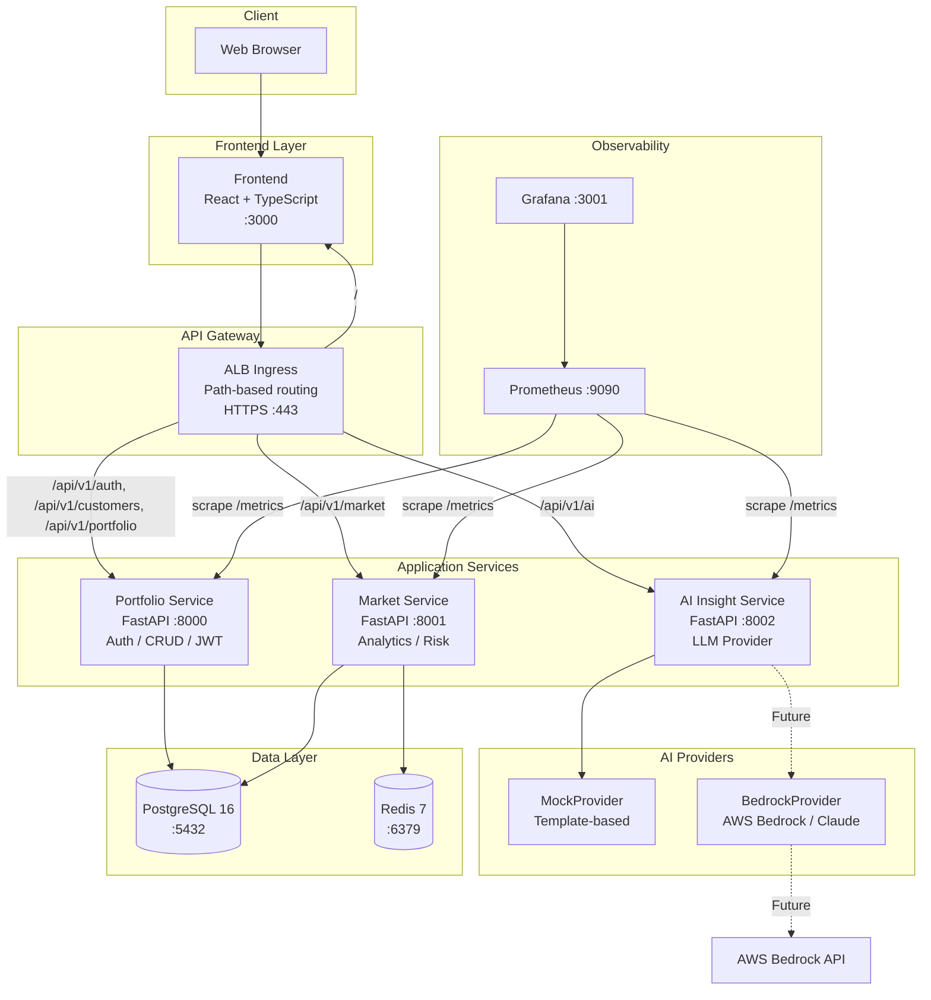

# IntelliWealth – Service Communication

## Service Interaction Diagram



---

## Request Flows

### 1. Authentication Flow

```
Browser → Frontend → ALB → Portfolio Service
                              │
                              ├─ POST /api/v1/auth/login
                              │   └─ Validate credentials against PostgreSQL
                              │   └─ Generate JWT access + refresh tokens
                              │   └─ Return tokens to Frontend
                              │
                              └─ All subsequent requests include:
                                  Authorization: Bearer <access_token>
```

### 2. Portfolio Management Flow

```
Frontend → Portfolio Service → PostgreSQL
              │
              ├─ POST /portfolio         → Create portfolio record
              ├─ POST /portfolio/add-asset → Insert asset with valuation
              ├─ GET  /portfolio/{id}     → Join portfolio + assets + history
              └─ GET  /portfolio/allocation/{id} → Compute allocation percentages
```

### 3. Market Intelligence Flow

```
Frontend → Market Service → Redis (cache check)
                │                 │
                │            ┌────▼────┐
                │            │  HIT?   │
                │            └────┬────┘
                │          Yes ──▶│──── Return cached data
                │                 │
                │           No ───▼
                │          PostgreSQL → Compute analytics
                │                        │
                │                   Store in Redis
                │                        │
                └────────────────────────▼
                              Return fresh data
```

### 4. Risk Assessment Flow

```
Frontend → Market Service /risk?portfolio_id={id}
              │
              ├─ Query portfolio assets from PostgreSQL (cross-service read)
              ├─ Compute allocation by asset type
              ├─ Calculate:
              │   ├─ HHI concentration score
              │   ├─ Diversification score (type count + evenness + gold bonus)
              │   ├─ Weighted portfolio volatility
              │   └─ Risk score (25% conc + 25% div + 30% vol + 20% equity)
              ├─ Apply business rules:
              │   ├─ equity > 80% → force HIGH risk
              │   └─ gold allocation → reduce risk by up to 15%
              ├─ Persist RiskMetrics to PostgreSQL
              ├─ Cache result in Redis
              └─ Return RiskAssessmentResponse
```

### 5. AI Insight Flow

```
Frontend → AI Insight Service → LLM Provider (DI)
              │                       │
              ├─ Build structured prompt with:
              │   ├─ Portfolio allocation data
              │   ├─ Risk metrics
              │   ├─ Compliance system prompt
              │   └─ Request type metadata
              │
              ├─ Route to active provider:
              │   ├─ MockProvider  → Template-based generation
              │   └─ BedrockProvider → AWS Bedrock API call
              │
              ├─ Append mandatory disclaimer
              ├─ Track metrics (tokens, latency)
              └─ Return structured response
```

### 6. Monitoring Flow

```
Prometheus (every 10-15s)
    │
    ├── Scrape portfolio-service:8000/metrics
    ├── Scrape market-service:8001/metrics
    ├── Scrape ai-insight-service:8002/metrics
    │
    ├── Evaluate alert rules
    │   ├── ServiceDown? (up == 0)
    │   ├── HighErrorRate? (5xx > 5%)
    │   ├── HighLatency? (p95 > 2s)
    │   └── AISlowResponse? (AI p95 > 10s)
    │
    └── Store time-series data (15d retention)

Grafana
    │
    ├── Query Prometheus via PromQL
    ├── Render Platform Overview dashboard
    └── Render Service Intelligence dashboard
```

---

## Data Flow Matrix

| Source | Destination | Protocol | Data | Auth |
|--------|-------------|----------|------|------|
| Browser | Frontend | HTTPS | Static assets, SPA | — |
| Frontend | Portfolio Service | REST/JSON | Auth, CRUD, portfolios | JWT |
| Frontend | Market Service | REST/JSON | Market queries, risk | — |
| Frontend | AI Insight Service | REST/JSON | Analysis requests | — |
| Portfolio Service | PostgreSQL | TCP/SQL | Customer, portfolio, asset data | DB credentials |
| Market Service | PostgreSQL | TCP/SQL | Market data, risk metrics | DB credentials |
| Market Service | Redis | TCP/RESP | Cached market analytics | — |
| AI Insight Service | MockProvider | In-process | Prompt → generated text | — |
| AI Insight Service | AWS Bedrock | HTTPS | Prompt → Claude response | AWS IAM |
| Prometheus | All services | HTTP GET | /metrics endpoint | — |
| Grafana | Prometheus | HTTP POST | PromQL queries | — |

---

## Port Allocation

| Port | Service | Protocol | Network |
|------|---------|----------|---------|
| 3000 | Frontend (Nginx) | HTTP | External |
| 3001 | Grafana | HTTP | Internal / External |
| 5432 | PostgreSQL | TCP | Internal |
| 6379 | Redis | TCP | Internal |
| 8000 | Portfolio Service | HTTP | Internal |
| 8001 | Market Service | HTTP | Internal |
| 8002 | AI Insight Service | HTTP | Internal |
| 9090 | Prometheus | HTTP | Internal |

---

## Health Check Chain

```
ALB Health Checks
    │
    ├── Frontend /nginx-health        → Nginx alive
    ├── Portfolio /readiness          → DB connection OK
    ├── Market /readiness             → DB + Redis OK
    └── AI Insight /readiness         → LLM provider OK

Kubernetes Probes
    │
    ├── startupProbe   → /health     → Container started
    ├── readinessProbe → /readiness  → Ready for traffic
    └── livenessProbe  → /liveness   → Process alive
```
